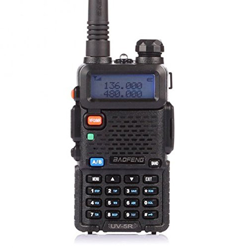

# BaoFeng UV-5R

## Features

25KHz/12.5KHz Switchable (Wide/Narrow Band)

FM Radio (65.0MHz-108.0MHz)

Large Inverted LCD Display

LED Flashlight

High /Low RF Power Switchable

VOX

50 CTCSS/ 104 DCS Tones

Tone searching/scanning

Dual standby

PC programmable

Transmitter time-out timer(TOT)

Busy channel lock-out(BCLO)

## UV-5R SPECIFICATIONS

Frequency range:

[TX] 136 - 174MHz, 400 - 520MHz

[RX] 136 - 174MHz, 400 - 520MHz, 68-108MHz (FM Broadcast)

Channel Capacity:

128 Channels

Channel Spacing

25KHz (wide band)12.5KHz (narrow band)

Sensitivity

≤0.25μV (wide band)  ≤0.35μV (narrow band)

Operation Voltage

7.4V DC ±20%

Battery:

1500mAh

Frequency step:

2.5, 5, 6.25, 10, 12.5, 20, 25, 30 and 50KHz

Antenna:

Antenna Connector: SMA-Female / Antenna Impedance: 50Ω

Accessory Connector:

Kenwood 2 Pin Standard

Stability:

±2.5ppm

Output power:

5W / 1W

Audio Power Output

700mW/10%

## Links

- [Manual](https://baofengtech.com/usermanual/BaoFeng_UV-5R_Manual.pdf)
