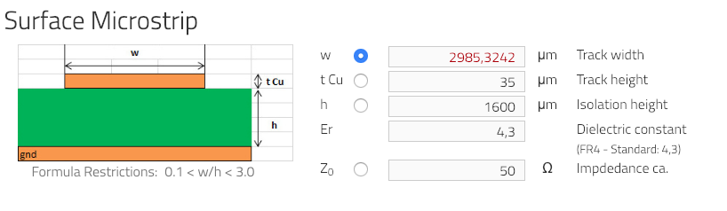
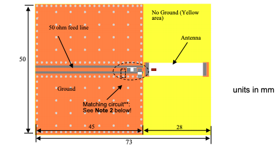

# 433mHz

## Tools

Strip line impedance calculator: <https://www.multi-circuit-boards.eu/en/pcb-design-aid/impedance-calculation.html>

50 ohm impedance feed line: <https://www.disk91.com/2015/technology/hardware/design-a-50ohm-impedance-net-for-rf-signals/>

## PDF's

- [433 MHz ISM Antenna SMD.pdf](433%20MHz%20ISM%20Antenna%20SMD.pdf)
