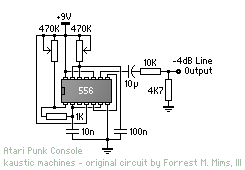

# Synthesizers

## Atari Punk Console

Modification (changed speaker to line output) of the Stepped Tone Generator taken from the "Engineer's Mini-Notebook - 555 Circuits" by Forrest M. Mims, III (Siliconcepts, 1984)

### Links

- <https://compiler.kaustic.net/machines/apc.html>
