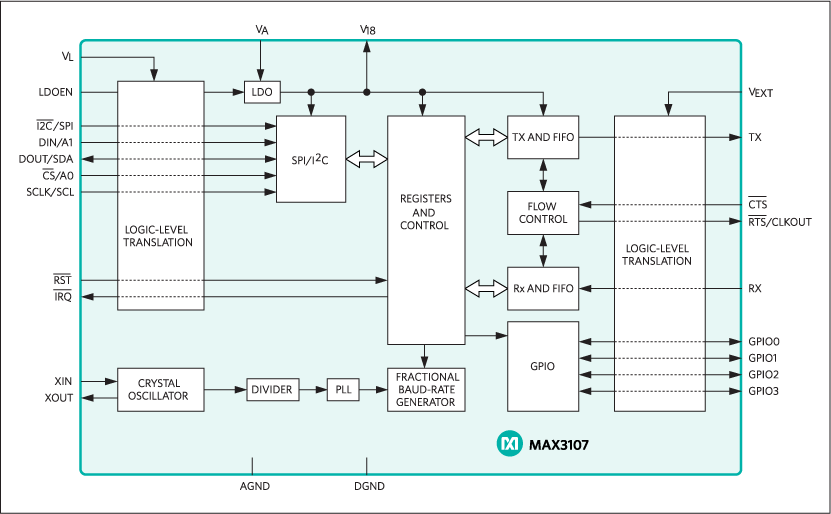

[Parent](../Readme.md)

# MAX3107

The MAX3107 is an advanced universal asynchronous receiver-transmitter (UART) with 128 words each of receive and transmit first-in/first-out (FIFO) that can be controlled through I²C or high-speed SPI™. The 2x and 4x rate modes allow a maximum of 24Mbps data rates. A phase-locked loop (PLL), prescaler, and fractional baud-rate generator allow for high-resolution baud-rate programming and minimize the dependency of baud rate on reference clock frequency.

## Datasheets

- [MAX3107.pdf](https://datasheets.maximintegrated.com/en/ds/MAX3107.pdf)
