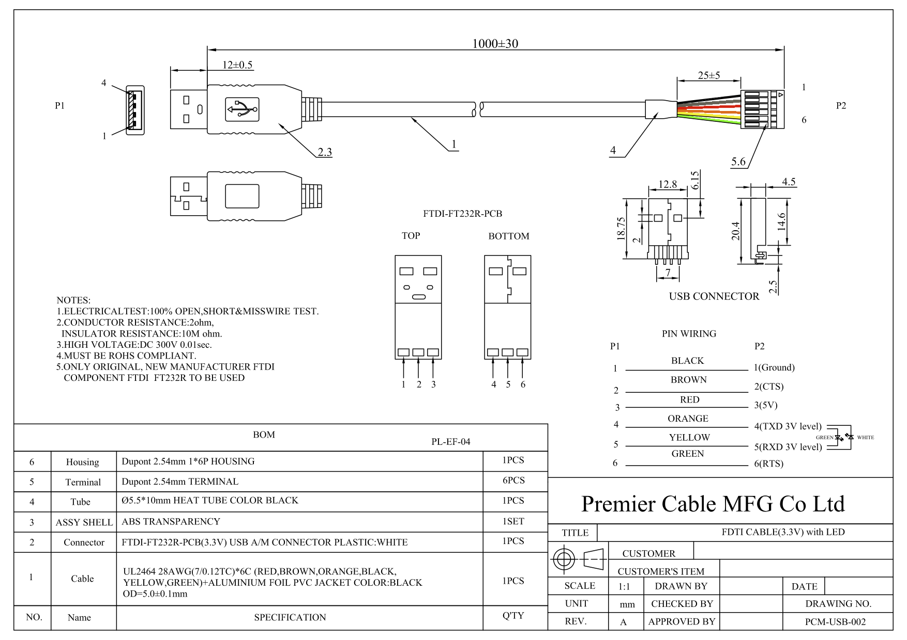
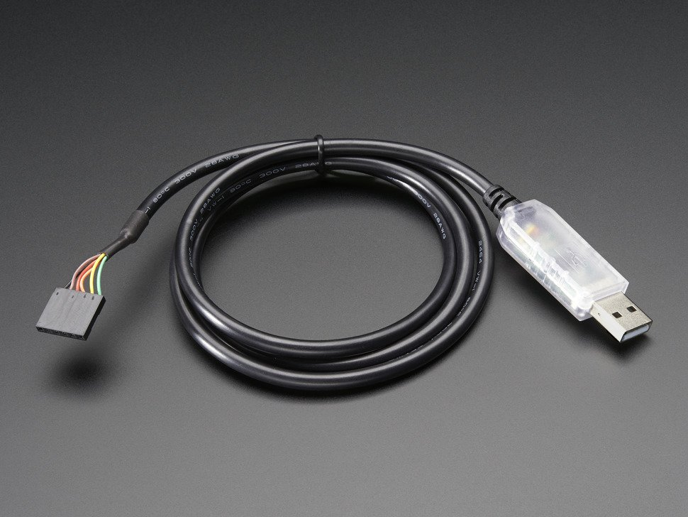

# FTDI

## FT232

This version have 3.3V. The data signals are at 3V and the power line provides 5V. We suggest this for any product that needs FTDI cables. Because the cable is 5V-logic compliant, you can use it with 3v or 5v logic just fine - no level shifting required!.

[Adafruit product page](https://www.adafruit.com/product/70)

### Links

- [DS_TTL-232R_CABLES_V201.pdf](https://cdn-shop.adafruit.com/datasheets/DS_TTL-232R_CABLES_V201.pdf)
