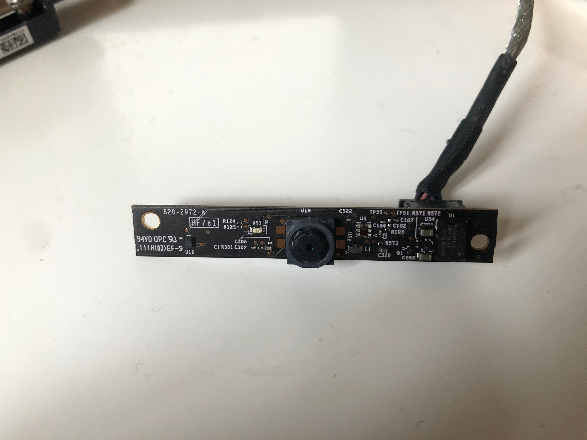
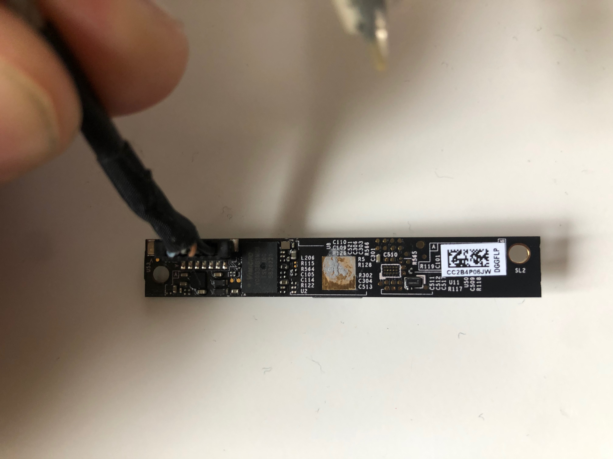
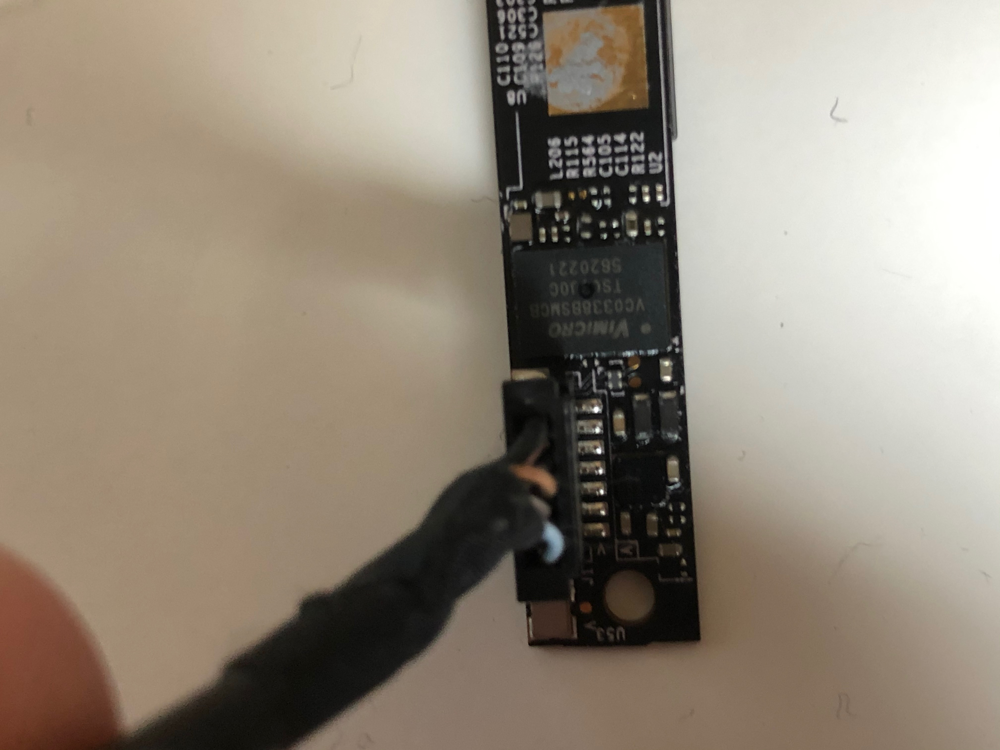
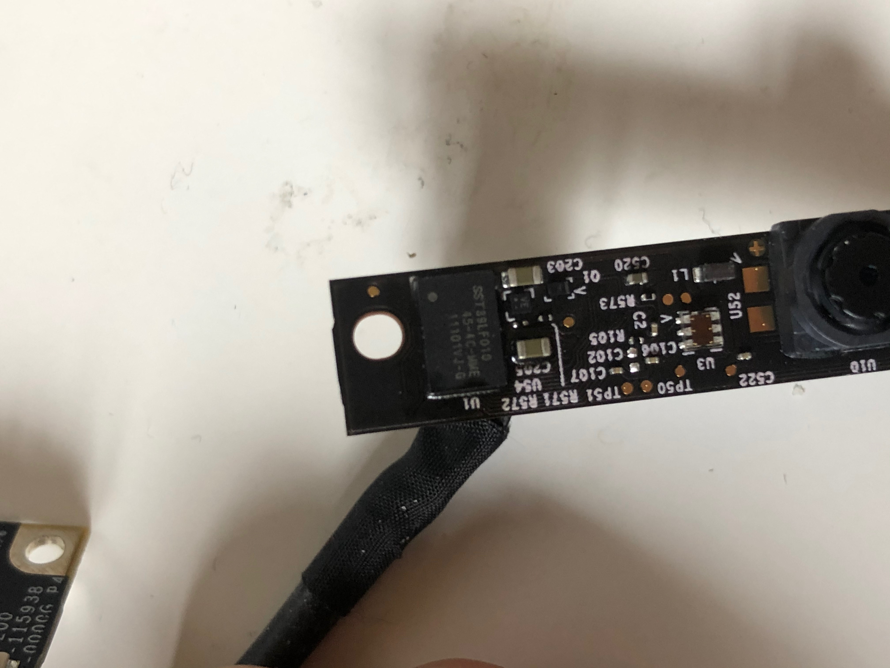
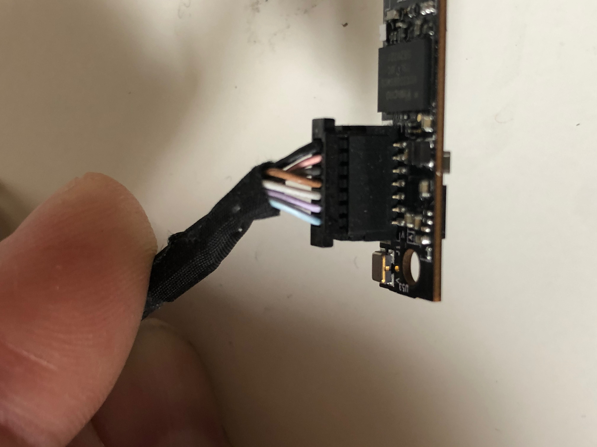
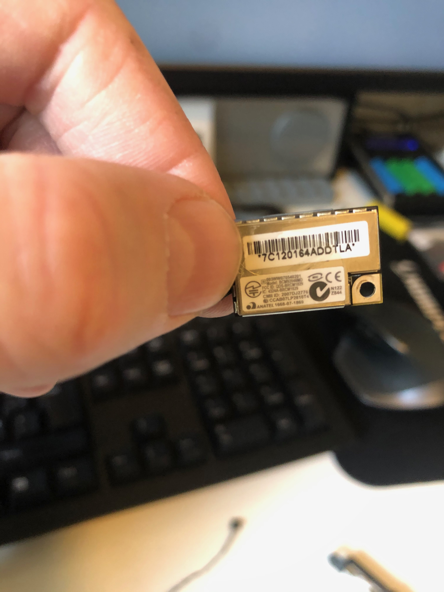

# iMac components

Components that are harvested from iMac 27" 2011.
The goal of this harvest is to see if I can reuse these components in other projects.

## Webcam

**Purpose**: Reuse this webcam as a USB webcam.

**Chip**: VC0331 / VC0338BSHB

*VC0338* is a dedicated PC Camera controller chip targeting for high quality standard-alone PC Camera or Notebook PC Embedded Camera. With its integrated high quality ISP and MJPEG compression engine, VC0338 can video stream HD (720P), SXGA at 30fps, and 2 Mega at 15fps.

This chip utilizes the most up-to-date technologies and offering a vast variety of functions for enhancing Web camera multimedia experiences.

Being Microsoft WHQL compliant, as well as supporting USB Video Class 1.0 standard and USB Audio Class 1.0 standard, this state-of-the-art design is a versatile solution that makes the creation of high speed, high resolution, high performance, low power Web cameras into a reality.

- [VC0331 Product Brief PDF](./files/VC0331_200_1.0_EN.pdf)
- [VC0338 Product information](http://www.vimicro.com/english/product/d_vc0338.htm#)

### Pin-outs

|Pin|Color|Use|
|---|---|---|
|1|Black|GND|
|2|Red| |
|3|Grey / Black| |
|4|Brown| |
|5|White| |
|6|Purple| |
|7|Light grey| |

### Images

## Bluetooth

### Images

