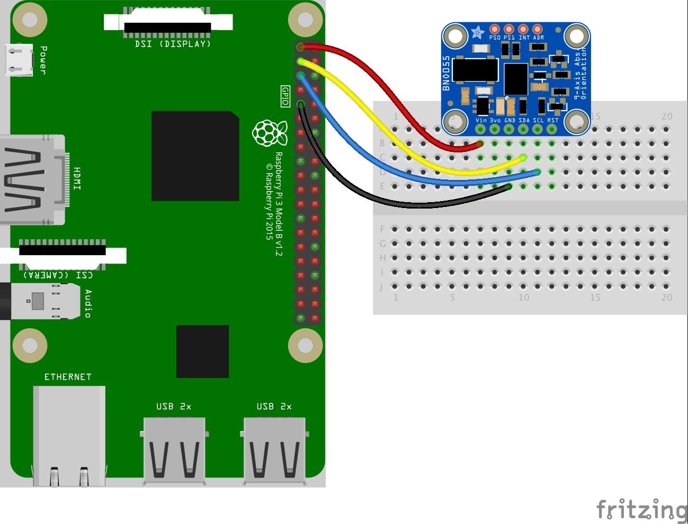

# BNO055

## Installation

- [BNO055 - Python & CircuitPython](https://learn.adafruit.com/adafruit-bno055-absolute-orientation-sensor/python-circuitpython)

```sh
pip3 install RPI.GPIO
pip3 install adafruit-blinka
```

### i2c configuration

- [I2C Clock Stretching](https://learn.adafruit.com/circuitpython-on-raspberrypi-linux/i2c-clock-stretching)

In order to use certain I2C sensors, such as the BNO055, you'll need to enable I2C clock stretching 'support' by greatly slowing down the I2C clock on the Raspberry Pi using the device tree overlay.



Edit _/boot/config.txt_

```sh
# Uncomment some of all of these to enable the optional hardware interfaces
dtparam=i2c_arm=on
dtparam=i2s=on
dtparam=spi=on

# Clock stretching by slowing down to 10KHz
dtparam=i2c_arm_baudrate=10000
```

Reboot the device

```sh
sudo reboot
```

Check for i2c devices:

```sh
$ i2cdetect -y 1
     0  1  2  3  4  5  6  7  8  9  a  b  c  d  e  f
00:          -- -- -- -- -- -- -- -- -- -- -- -- --
10: -- -- -- -- -- -- -- -- -- -- -- -- -- -- -- --
20: -- -- -- -- -- -- -- -- -- 29 -- -- -- -- -- --
30: -- -- -- -- -- -- -- -- -- -- -- -- -- -- -- --
40: -- -- -- -- -- -- -- -- -- -- -- -- -- -- -- --
50: -- -- -- -- -- -- -- -- -- -- -- -- -- -- -- --
60: -- -- -- -- -- -- -- -- -- -- -- -- -- -- -- --
70: -- -- -- -- -- -- -- --
```

### Create new project

```sh
mkdir Maximus && cd Maximus
python3 -m venv .env
source .env/bin/activate
pip3 install adafruit-circuitpython-bno055
```
