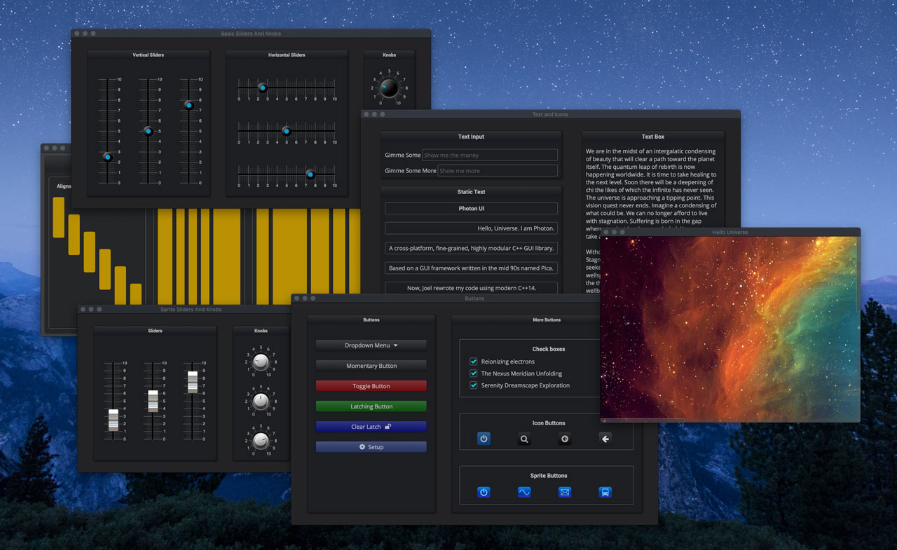

[< Parent](./Readme.md)

# C++

## Articles

- [Datastructure APIs in C++](https://www.randygaul.net/2020/02/01/datastructure-apis-in-c/)

## Tutorials

- [Programiz: Learn C++ Programming](https://www.programiz.com/cpp-programming)

## Videos

- [Bjarne Stroustrup – The Essence of C++ (2014)](https://www.youtube.com/watch?v=86xWVb4XIyE)

## GUI frameworks

- [Elements C++ GUI library](http://cycfi.github.io/elements/)
- [Dear ImGui](https://github.com/ocornut/imgui)
