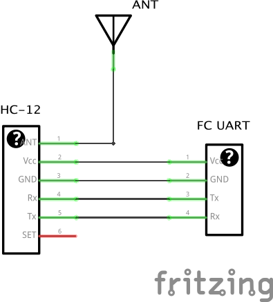
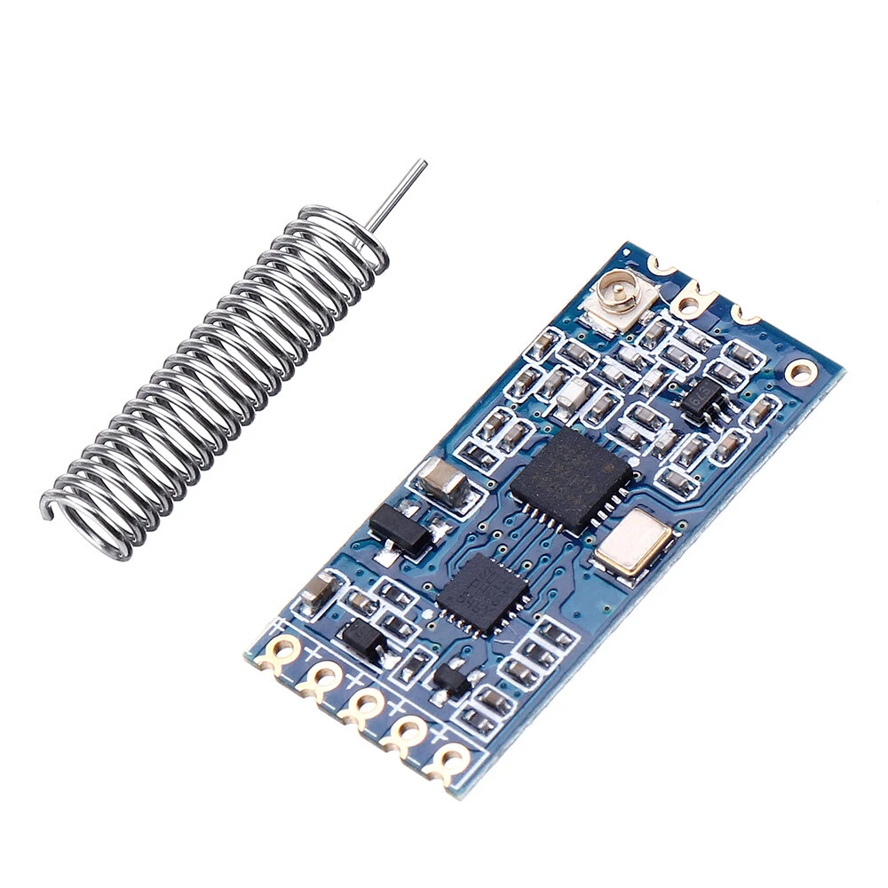
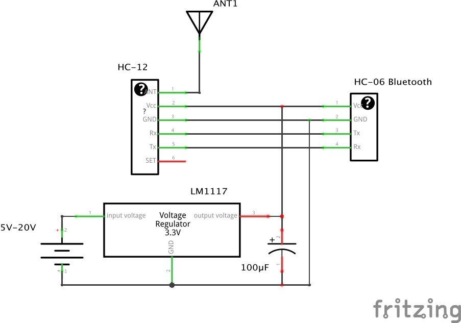
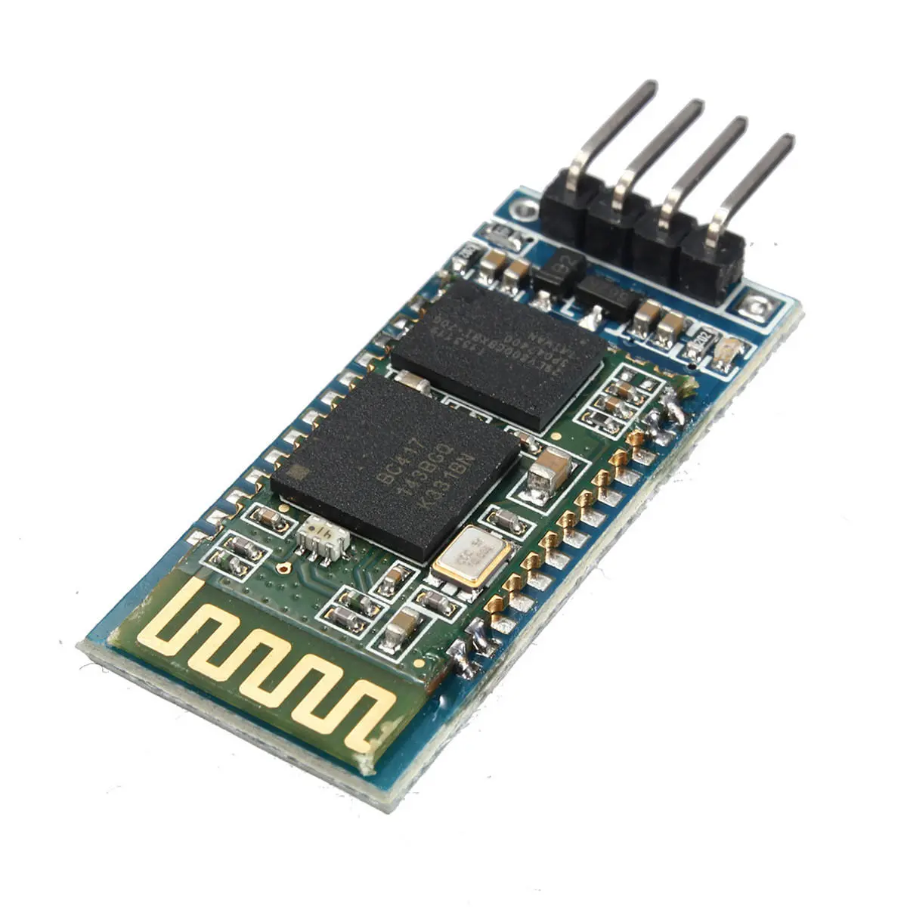

[< Parent](./Readme.md)

# High speed follow me - Telemetry link

This is a sketching of an idea of a high speed follow me drone.

A simple mobile application that get the current GPS data from the phone and sends it to the drone via RF. The drone will take the GPS data and add as waypoint to navigate to. Hopefully the drone will then follow the same path as the phone.

## Drone schematics

## Ground station schematics

## Resources

- [iNavFlight Missions](https://github.com/iNavFlight/inav/wiki/iNavFlight-Missions)
- [DIY wireless telemetry link for UAV](https://quadmeup.com/diy-wireless-telemetry-link-for-uav/)
- [Build your own TX antenna for FPV](https://www.rcgroups.com/forums/showthread.php?1159968-Build-your-own-TX-antenna-for-FPV)
- [How to log GPS coordinates in Taranis](https://oscarliang.com/log-gps-coordinates-taranis/)

## Component links

- [Geekcreit HC-12 433MHz SI4463](https://www.banggood.com/Geekcreit-HC-12-433MHz-SI4463-Wireless-Serial-Module-Wireless-Transceiver-Transmission-Serial-Communication-Data-Board-Remote-1000M-p-973522.html)
- [Geekcreit HC-06 Wireless bluetooth Transceiver](https://www.banggood.com/Geekcreit-HC-06-Wireless-bluetooth-Transceiver-RF-Main-Module-Serial-Geekcreit-for-Arduino-products-that-work-with-official-Arduino-boards-p-80364.html)
