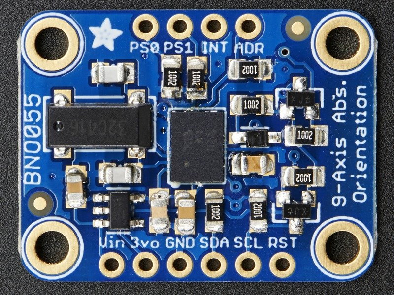
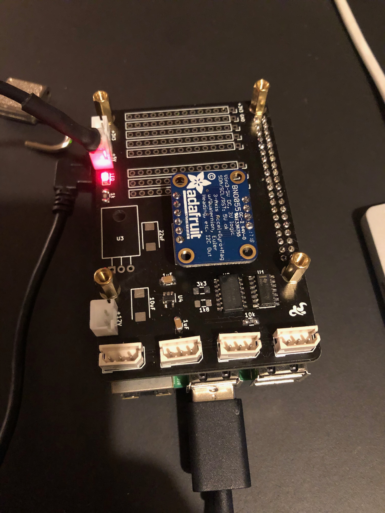

[< Parent](./Readme.md)

# BNO055

Intelligent 9-axis absolute orientation sensor.



The BNO055 can output the following sensor data:

- **Absolute Orientation** (Euler Vector, 100Hz) Three axis orientation data based on a 360° sphere
- **Absolute Orientation** (Quatenrion, 100Hz) Four point quaternion output for more accurate data manipulation
- **Angular Velocity Vector** (100Hz) Three axis of 'rotation speed' in rad/s
- **Acceleration Vector** (100Hz) Three axis of acceleration (gravity + linear motion) in m/s^2
- **Magnetic Field Strength Vector** (20Hz) Three axis of magnetic field sensing in micro Tesla (uT)
- **Linear Acceleration Vector** (100Hz) Three axis of linear acceleration data (acceleration minus gravity) in m/s^2
- **Gravity Vector** (100Hz) Three axis of gravitational acceleration (minus any movement) in m/s^2
- **Temperature** (1Hz) Ambient temperature in degrees celsius



## Technical Details

- Dimensions: 20mm x 27mm x 4mm / 0.8" x 1.1" x 0.2"
- Header holes begin 4mm from the mounting holes
- Mounting Hole dimensions: 20mm x 12mm apart
- Uses I2C address 0x28 (default) or 0x29
- Weight: 3g

## Pinouts

### Power Pins

- **VIN**: 3.3-5.0V power supply input
- **3VO**: 3.3V output from the on-board linear voltage regulator, you can grab up to about 50mA as necessary
- **GND**: The common/GND pin for power and logic

### I2C Pins

- **SCL** - I2C clock pin, connect to your microcontrollers I2C clock line. This pin can be used with 3V or 5V logic, and there's a 10K pullup on this pin.
- **SDA** - I2C data pin, connect to your microcontrollers I2C data line. This pin can be used with 3V or 5V logic, and there's a 10K pullup on this pin.

### Other Pins

- **RST**: Hardware reset pin.  Set this pin low then high to cause a reset on the sensor. This pin is 5V safe.
- **INT**: The HW interrupt output pin, which can be configured to generate an interrupt signal when certain events occur like movement detected by the accelerometer, etc. (not currently supported in the Adafruit library, but the chip and HW is capable of generating this signal). The voltage level out is 3V
- **ADR**: Set this pin high to change the default I2C address for the BNO055 if you need to connect two ICs on the same I2C bus. The default address is 0x28. If this pin is connected to 3V, the address will be 0x29
- **PS0** and **PS1**: These pins can be used to change the mode of the device (it can also do HID-I2C and UART) and also are provided in case Bosch provides a firmware update at some point for the ARM Cortex M0 MCU inside the sensor. They should normally be left unconnected.

## Installation

- [BNO055 - Python & CircuitPython](https://learn.adafruit.com/adafruit-bno055-absolute-orientation-sensor/python-circuitpython)

```sh
pip3 install RPI.GPIO
pip3 install adafruit-blinka
```

### i2c configuration

- [I2C Clock Stretching](https://learn.adafruit.com/circuitpython-on-raspberrypi-linux/i2c-clock-stretching)

In order to use certain I2C sensors, such as the BNO055, you'll need to enable I2C clock stretching 'support' by greatly slowing down the I2C clock on the Raspberry Pi using the device tree overlay.


Edit _/boot/config.txt_

```sh
# Uncomment some of all of these to enable the optional hardware interfaces
dtparam=i2c_arm=on
dtparam=i2s=on
dtparam=spi=on

# Clock stretching by slowing down to 10KHz
dtparam=i2c_arm_baudrate=10000
```

Reboot the device

```sh
sudo reboot
```

Check for i2c devices:

```sh
$ i2cdetect -y 1
     0  1  2  3  4  5  6  7  8  9  a  b  c  d  e  f
00:          -- -- -- -- -- -- -- -- -- -- -- -- --
10: -- -- -- -- -- -- -- -- -- -- -- -- -- -- -- --
20: -- -- -- -- -- -- -- -- 28 -- -- -- -- -- -- --
30: -- -- -- -- -- -- -- -- -- -- -- -- -- -- -- --
40: -- -- -- -- -- -- -- -- -- -- -- -- -- -- -- --
50: -- -- -- -- -- -- -- -- -- -- -- -- -- -- -- --
60: -- -- -- -- -- -- -- -- -- -- -- -- -- -- -- --
70: -- -- -- -- -- -- -- --
```

### Create new project

```sh
mkdir Maximus && cd Maximus
python3 -m venv .env
source .env/bin/activate
pip3 install adafruit-circuitpython-bno055
```

Example data from sensor:

```sh
Temperature: 28 degrees C
Accelerometer (m/s^2): (-0.2, -0.07, -9.77)
Magnetometer (microteslas): (-27.75, -4.0625, 32.5)
Gyroscope (rad/sec): (-0.001090830782496456, -0.004363323129985824, 0.0)
Euler angle: (None, None, None)
Quaternion: (0.011474609375, -0.3623046875, 0.9320068359375, 0.0)
Linear acceleration (m/s^2): (1.28, 0.0, -0.01)
Gravity (m/s^2): (-0.21, -0.08, -9.8)
```

## Notes

### Merge accelerometer and GPS

- Accelerometer: High frequency, high accuracy
  - Absolute North east and down
  - acceleration: [ax ay az]
  - gyroscope:    [gx gy gz]
  - magnetometer: [mx my mz]
- GPS: Low frequency, low accuracy
  - Latitude, longitude and altitude

Accelerometer + GPS = predicted positions.

Kalman filter

```sh
[
     P = Position
     V = Velocity
]
```

- Predict(accelerometer)
- Update(GPS)

| Key | What                      | Matrix          | Comment                                |
| --- | ------------------------- | --------------- | -------------------------------------- |
| A   | state transition matrix   |                 |                                        |
| B   | control matrix            |                 |                                        |
| u   | control vector            |                 |                                        |
| Q   | process variance          | [o¹ 0<br/>0 o²] | https://en.wikipedia.org/wiki/Variance |
| R   | measurements variance     | [o¹ 0<br/>0 o²] |                                        |
| Z   | Actual measurement vector | [P<br/>V]       | Raw GPS readings                       |

Velocity readings are done using [Doppler shift](https://imagine.gsfc.nasa.gov/features/yba/M31_velocity/spectrum/doppler_more.html).

```Pf = π + vΔt + ½ aΔt²```

```Vf = Vi + aΔt```

```sh
[ P     [1 Δt                [½Δt²
  V ] =  0 1] x prev_state     Δt ] [ a ]
state     A     prev_State      B     u
```

Z = [PV] (GPS)

## PID controller

- [Arduino BNO055 PID Gyro sensor](https://gist.github.com/saschazar21/382376c5448a585c6b3d5f142e3c7af6)
- [PID Control for multiple linear actuators](https://forum.arduino.cc/index.php?topic=625875.0)
- [An introduction and tutorial for PID controllers (PDF)](./pdfs/pid_control_document.pdf)

## Documents

- [Datasheet](./pdfs/BST_BNO055_DS000_14.pdf)

## Videos

- [How to Implement an Inertial Measurement Unit (IMU) Using an Accelerometer, Gyro, and Magnetometer](https://www.youtube.com/watch?v=T9jXoG0QYIA)
- [How to Merge Accelerometer with GPS to Accurately Predict Position and Velocity](https://www.youtube.com/watch?v=6M6wSLD-8M8)
- [Understanding Kalman Filters](https://www.youtube.com/watch?v=mwn8xhgNpFY)

## Links

- [Adafruit BNO055](https://github.com/adafruit/Adafruit_BNO055)
- [Adafruit BNO055 absolute orientation sensor](https://learn.adafruit.com/adafruit-bno055-absolute-orientation-sensor/overview)
