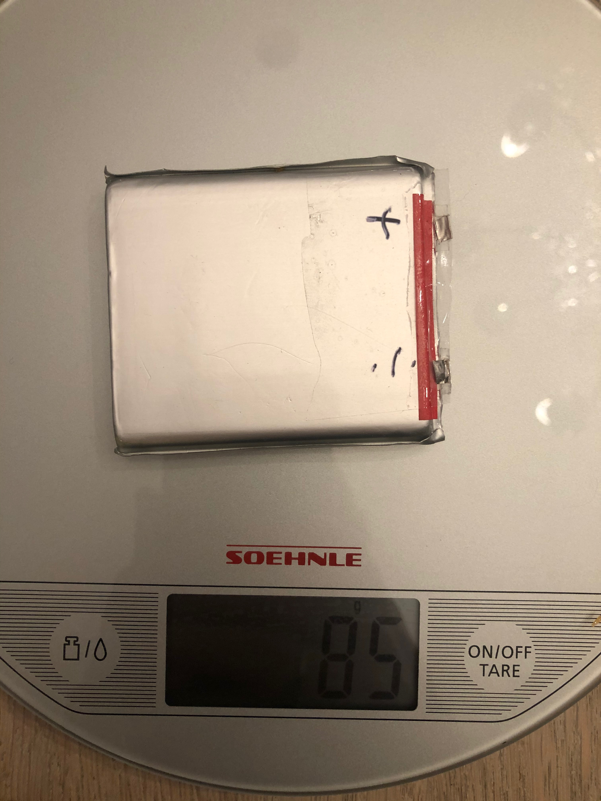
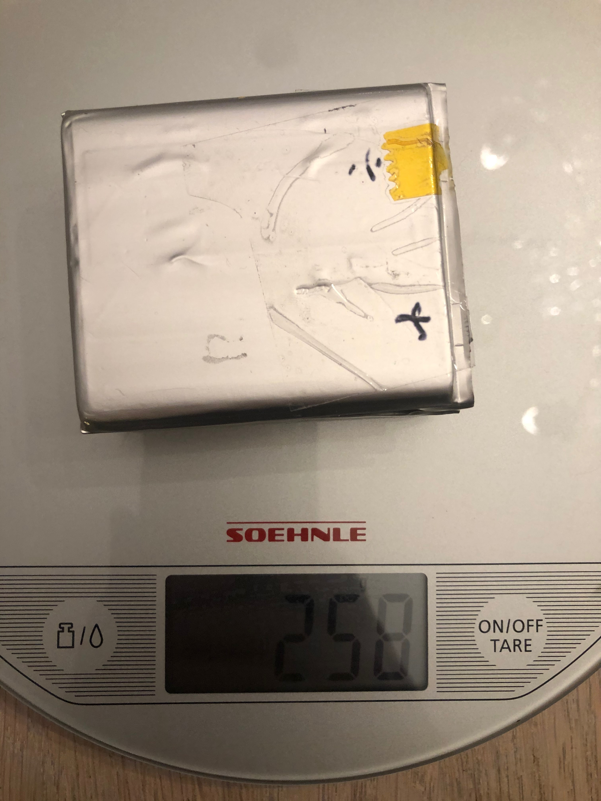
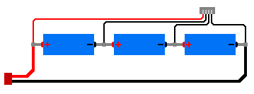
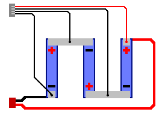

[< Parent](./Readme.md)

# Battery

Battery pack made of 3 cells in series harvested from an old MacBook Pro that will provide 11.1v with (fill in capacity)mAh.

## Weight

Each battery weighs around 85 grams.

For all three without cables and connections it's about 258 grams.

## Wiring

If each individual cell is rated for 3.7v @ 3000mAh and 20C discharge rate, the configuration above would result in a pack rated for 11.1v @ 3000mAh with a max discharge rate of 60 amps.

## Tools

- [Lipo Wiring](https://scriptasylum.com/rc_speed/lipo.html)

## Buy batteries

- [Batteri Online](https://batterionline.no/)
- [SONY US18650VTC6 - 30A](https://batterionline.no/sony-us18650vtc6-30a)
