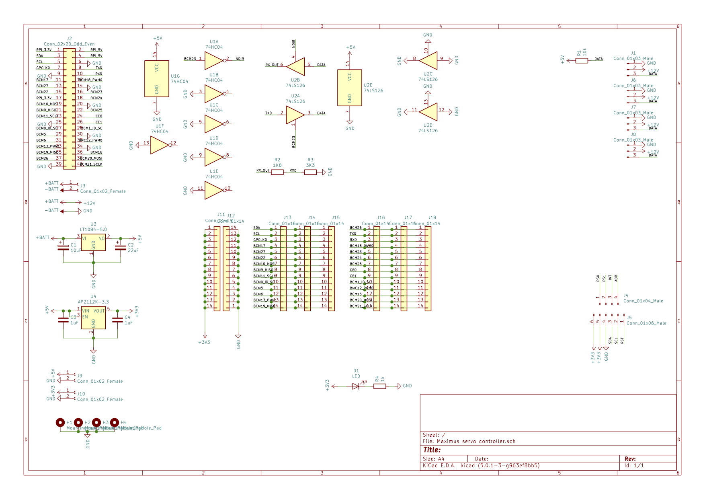
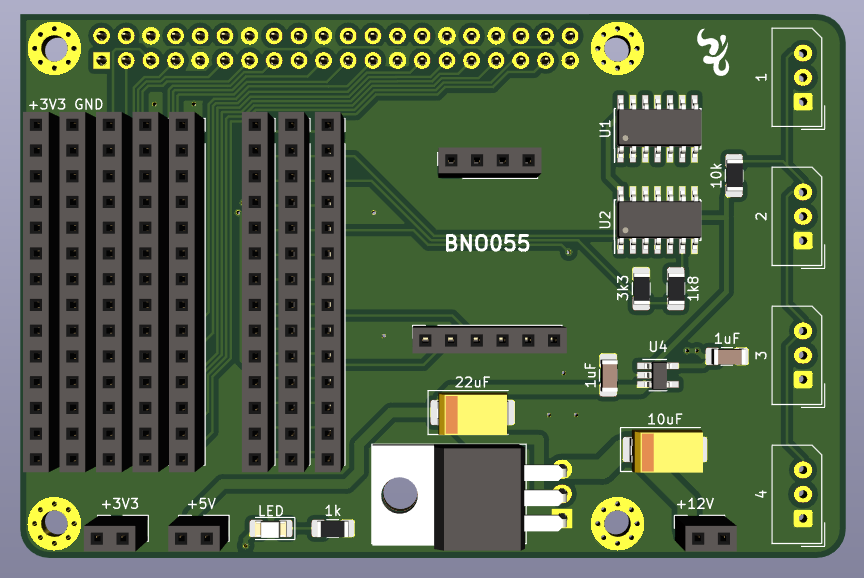
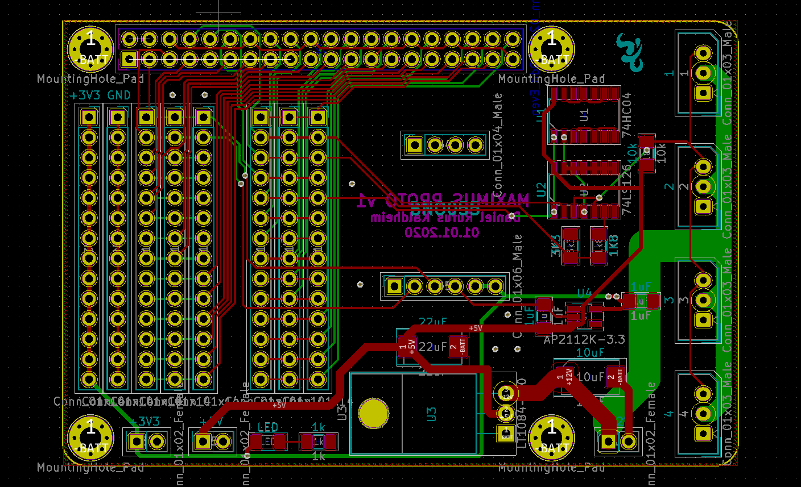
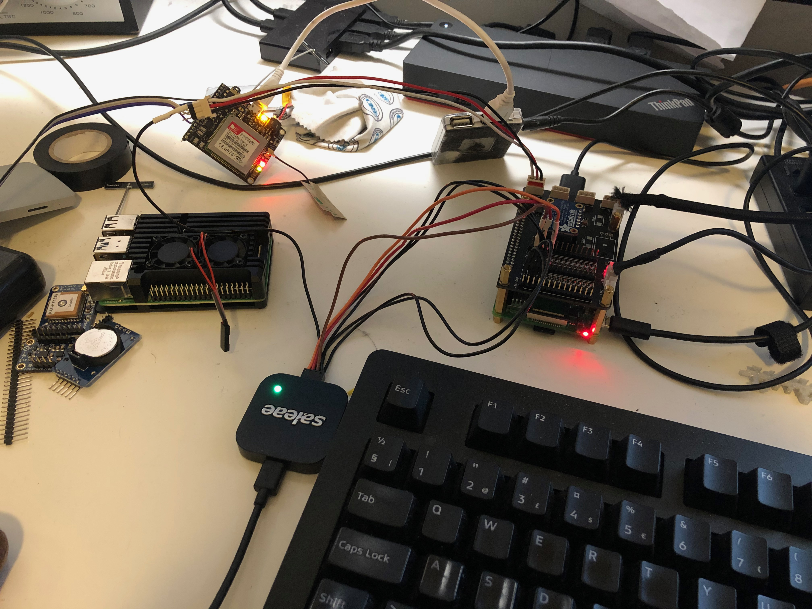
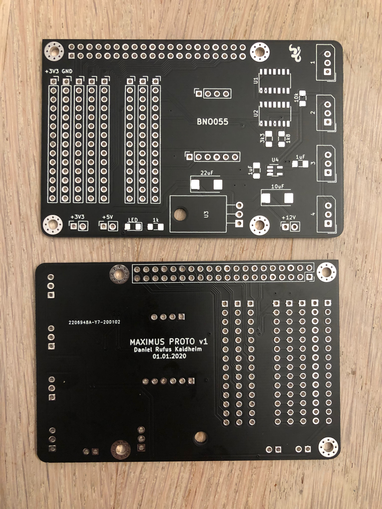
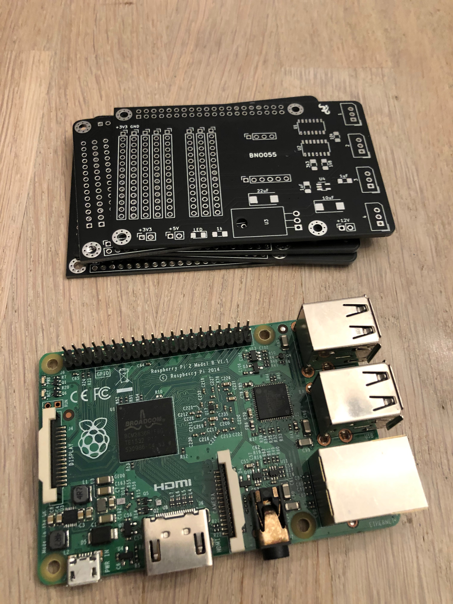

[< Parent](./Readme.md)

# Development board







## Whoopsies

### Molex pinout

Molex pin 1 (GND) and pin 3 (DATA) have switched place.

From robotis webpage:
```WARNING: Check the pinout! The pinout of DYNAMIXEL can differ from the pinout of connector manufacturer.```

### BNO055

Connection pins are mounted mirrored, resulting in the breakout board for BNO055 is upside down.

### Raspberry pi

The distance between the connectors on the raspberry pi and the development board are just a little more than two 2x40 female pins connector when using standard (fill in mm) standoffs. This results in bad connection. Resolution will be a 3D-printed standoff.

## Raspberry Pi pinout


## Diagnostics



## Photos



