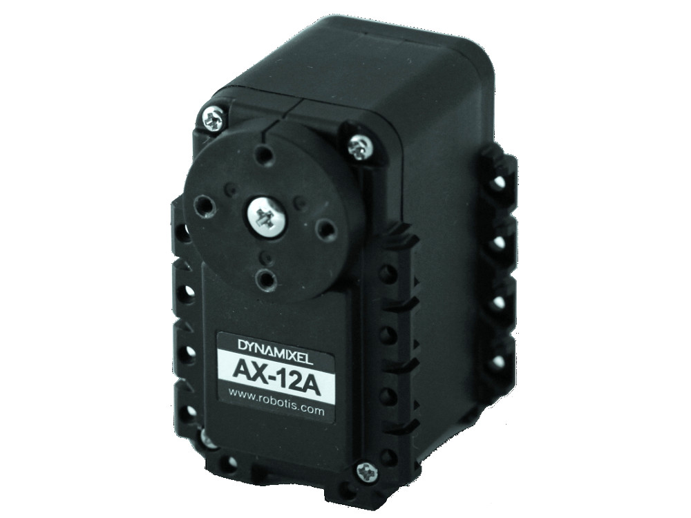

# Dynamixel AX-12A

DYNAMIXEL is a robot exclusive smart actuator with fully integrated DC Motor + Reduction Gearhead + Controller + Driver + Network in one DC servo module.



## Specification

| Item                   | Specification                                                          |
| ---------------------- | ---------------------------------------------------------------------- |
| Baud Rate              | 7843 bps ~ 1 Mbps                                                      |
| Resolution             | 0.29 [°]                                                               |
| Running Degree         | 0 [°] ~ 300 [°] Endless Turn                                           |
| Weight                 | 53.5g(AX-12, AX-12+), 54.6g(AX-12A)                                    |
| Dimensions (W x H x D) | 32mm x 50mm x 40mm                                                     |
| Gear Ratio             | 254 : 1                                                                |
| Stall Torque           | 1.5 N*m (at 12V, 1.5A)                                                 |
| No Load Speed          | 59rpm (at 12V)                                                         |
| Operating Temperature  | -5 [°C] ~ +70 [°C]                                                     |
| Input Voltage          | 9.0 ~ 12.0V (**Recommended** : 11.1V)                                  |
| Command Signal         | Digital Packet                                                         |
| Protocol Type          | Half Duplex Asynchronous Serial Communication (8bit, 1stop, No Parity) |
| Physical Connection    | TTL Level Multi Drop Bus                                               |
| ID                     | 0 ~ 253                                                                |
| Feedback               | Position, Temperature, Load, Input Voltage, etc                        |
| Material               | Engineering Plastic                                                    |

## Wiring

| Item           | TTL                                                                                                                                                                   |
| -------------- | --------------------------------------------------------------------------------------------------------------------------------------------------------------------- |
| Pinout         | 1 GND<br />2 VDD<br />3 DATA                                                                                                                                          |
| Diagram        |                                                                                                                        |
| Housing        | <br />[MOLEX 50-37-5033](http://www.molex.com/molex/products/datasheet.jsp?part=active/0050375033_CRIMP_HOUSINGS.xml) |
| PCB Header     | <br />[MOLEX 22-03-5035](http://www.molex.com/molex/products/datasheet.jsp?part=active/0022035035_PCB_HEADERS.xml)    |
| Crimp Terminal | [MOLEX 08-70-1039](http://www.molex.com/molex/products/datasheet.jsp?part=active/0008701039_CRIMP_TERMINALS.xml)                                                      |
| Wire Gauge     | 21 AWG                                                                                                                                                                |

## TTL communications

To control the DYNAMIXEL actuators, the main controller needs to convert its UART signals to the half duplex type.

The recommended circuit diagram for this is shown below.


## Dimensions

Screws: M2x04 or M2x06


## Links

- [E-manual](http://emanual.robotis.com/docs/en/dxl/ax/ax-12a/)
- [Dynamixel SDK](https://github.com/ROBOTIS-GIT/DynamixelSDK)

## Raspberry pi

Set configuration parameters in /boot/config.txt:

```sh
enable_uart=1
init_uart_clock=16000000
```

## Communications

More information about communication [Protocol 1.0](http://emanual.robotis.com/docs/en/dxl/protocol1/#status-packet).

Instruction Packet is the command data sent to the Device.

| Header1 | Header2 | ID  | Length | Instruction | Param 1 | …   | Param N | Checksum |
| ------- | ------- | --- | ------ | ----------- | ------- | --- | ------- | -------- |
| 0xFF    | 0xFF    | ID  | Length | Instruction | Param 1 | …   | Param N | CHKSUM   |

### Header

The field indicates the start of the Packet.

### Packet ID

The field that indicates the ID of the Device that should receive the Instruction Packet and process it

1. Range : 0 ~ 253 (0x00 ~ 0xFD), which is a total of 254 numbers that can be used.
2. Broadcast ID : 254 (0xFE), which makes all connected devices execute the Instruction Packet.

### Length

The length of the Packet(Instruction, Parameter, Checksum fields). Length = number of Parameters + 2

### Instruction

The field that defines the type of instruction.

| Value | Instructions  | Description                                                                                                                                               |
| ----- | ------------- | --------------------------------------------------------------------------------------------------------------------------------------------------------- |
| 0x01  | Ping          | Instruction that checks whether the Packet has arrived to a device with the same ID as Packet ID                                                          |
| 0x02  | Read          | Instruction to read data from the Device                                                                                                                  |
| 0x03  | Write         | Instruction to write data on the Device                                                                                                                   |
| 0x04  | Reg Write     | Instruction that registers the Instruction Packet to a standby status; Packet is later executed through the Action instruction                            |
| 0x05  | Action        | Instruction that executes the Packet that was registered beforehand using Reg Write                                                                       |
| 0x06  | Factory Reset | Instruction that resets the Control Table to its initial factory default settings                                                                         |
| 0x08  | Reboot        | Instruction that reboots DYNAMIXEL(See applied products in the description)                                                                               |
| 0x83  | Sync Write    | For multiple devices, Instruction to write data on the same Address with the same length at once                                                          |
| 0x92  | Bulk Read     | For multiple devices, Instruction to write data on different Addresses with different lengths at once<br /> This command can only be used with MX series. |


### Parameters

Parameters are used when additional data is required for an instruction.

### Instruction Checksum

It is used to check if packet is damaged during communication. Instruction Checksum is calculated according to the following formula.

Instruction Checksum = ```~( ID + Length + Instruction + Parameter1 + … Parameter N )```

Where “~” is the Binary Ones Complement operator. When the calculation result of the parenthesis in the above formula is larger than 255 (0xFF), use only lower bytes.

For example, when you want to use below Instruction Packet,

```ID=1(0x01), Length=5(0x05), Instruction=3(0x03), Parameter1=12(0x0C), Parameter2=100(0x64), Parameter3=170(0xAA)```

```sh
Checksum = ~ ( ID + Length + Instruction + Parameter1 + … Parameter 3 ) = ~ [ 0x01 + 0x05 + 0x03 + 0x0C + 0x64 + 0xAA ] = ~ [ 0x123 ] # Only the lower byte 0x23 executes the Not operation. = 0xDC
```

Thus, Instruction Packet should be ```0xFF, 0xFF, 0x01, 0x05, 0x03, 0x0C, 0x64, 0xAA, 0xDC```.

### Sample code

#### Simple Move

The values are hardcoded to move Dynamixel 1:

- Execute an action (5),
- send 3 bytes of data,
- MOVE command(1E) and 2 positions(32 03) followed by the CRC (A3).

I needed a small sleep(0.1), the port.write takes more time and the output was already LOW.

```python
#!/usr/bin/env python

import serial
import time
import RPi.GPIO as GPIO

GPIO.setmode(GPIO.BOARD)
GPIO.setup(16, GPIO.OUT)

port = serial.Serial("/dev/ttyAMA0", baudrate=1000000, timeout=3.0)

try:
    print("Write first hex sequence")
    GPIO.output(16, GPIO.HIGH)
    port.write(bytearray.fromhex("FF FF 01 05 03 1E 32 03 A3")) # 255 255 1 5 3 30 50 3 163
    time.sleep(0.1)
    GPIO.output(16, GPIO.LOW)

    time.sleep(3)

    print("Write second hex sequence")
    GPIO.output(16,GPIO.HIGH)
    port.write(bytearray.fromhex("FF FF 01 05 03 1E CD 00 0b"))
    time.sleep(0.1)
    GPIO.output(16,GPIO.LOW)

    print("Done")
    time.sleep(5)
except KeyboardInterrupt: # If CTRL+C is pressed, exit cleanly:
    print("Keyboard interrupt")

except:
    print("some error")

finally:
    print("clean up")
    GPIO.cleanup() # cleanup all GPIO
```

#### Read ID

The ID is a unique value in the network to identify each DYNAMIXEL with an Instruction Packet. 0~252 (0xFC) values can be used as an ID, and 254(0xFE) is occupied as a broadcast ID. The Broadcast ID(254, 0xFE) can send an Instruction Packet to all connected DYNAMIXEL simultaneously.

| hex | dec | Command      | Comment                                        |
| --- | --- | ------------ | ---------------------------------------------- |
| FF  | 255 | Header       |                                                |
| FF  | 255 | Header2      |                                                |
| FE  | 254 | To all ID's  |                                                |
| 04  | 4   | Length       |                                                |
| 02  | 2   | 4 μsec       | Status Packet for Return Delay Time(5).        |
| 00  | 0   | Model Number | This address stores model number of DYNAMIXEL. |
| 03  | 3   | ID           | Dynamixel ID                                   |
| F5  |     | CRC          | Checksum                                       |

```python
#!/usr/bin/env python

import serial
import time
import RPi.GPIO as GPIO

GPIO.setmode(GPIO.BOARD)
GPIO.setup(16, GPIO.OUT)

port = serial.Serial("/dev/ttyAMA0", baudrate=1000000, timeout=3.0)

try:
    print("Read ID")
    GPIO.output(16, GPIO.HIGH)
    port.write(bytearray.fromhex("FF FF FE 04 02 00 03 F5"))
    time.sleep(0.1)
    GPIO.output(16, GPIO.LOW)

    print("Done")
    time.sleep(5)
except KeyboardInterrupt: # If CTRL+C is pressed, exit cleanly:
    print("Keyboard interrupt")

except:
    print("some error")

finally:
    print("clean up")
    GPIO.cleanup() # cleanup all GPIO
```
