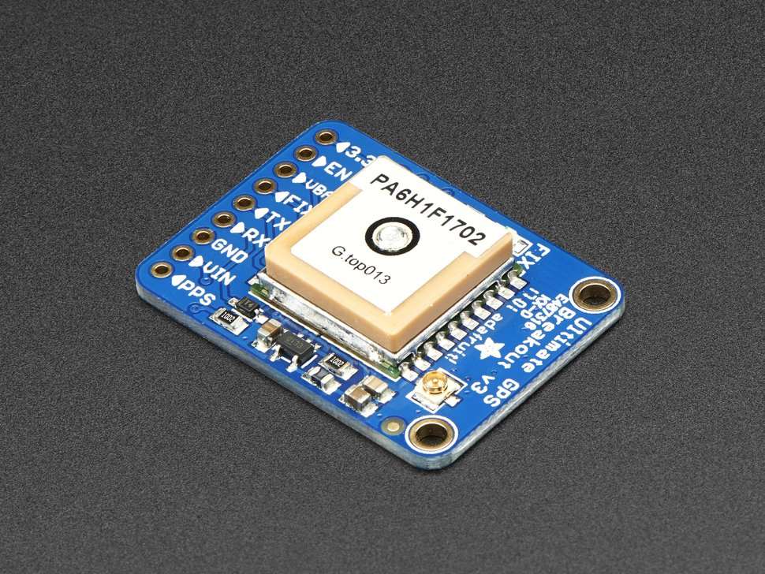
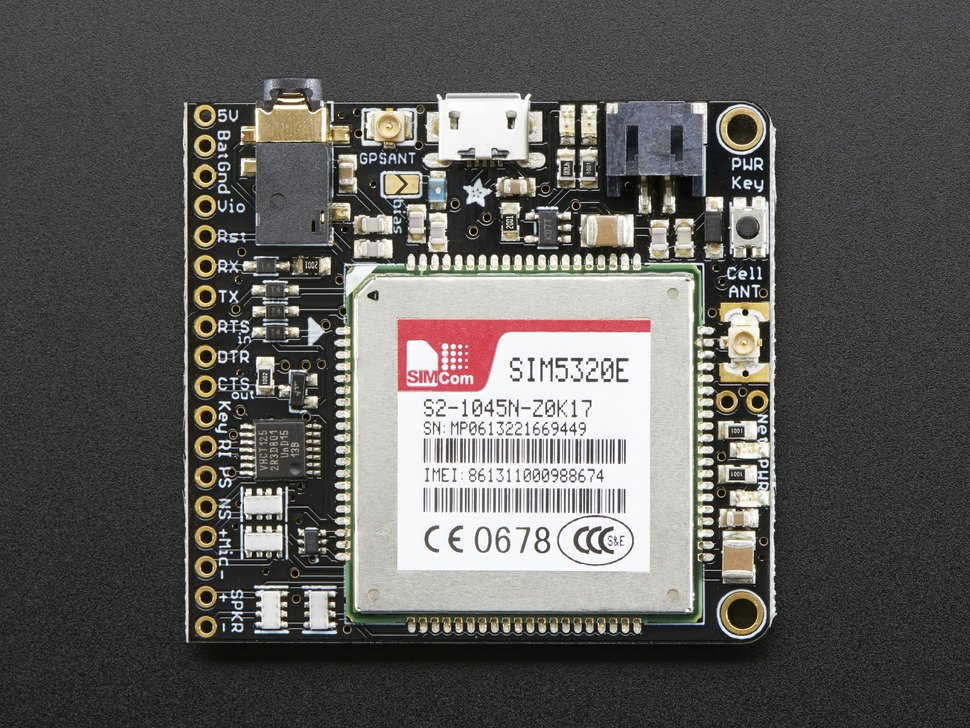

# GPS

## Adafruit ultimate GPS breakout


- -165 dBm sensitivity, 10 Hz updates, 66 channels
- 5V friendly design and only 20mA current draw
- Breadboard friendly + two mounting holes
- RTC battery-compatible
- Built-in datalogging
- PPS output on fix
- Internal patch antenna + u.FL connector for external active antenna
- Fix status LED



### Technical details

- Satellites: 22 tracking, 66 searching
- Patch Antenna Size: 15mm x 15mm x 4mm
- Update rate: 1 to 10 Hz
- Position Accuracy: < 3 meters (all GPS technology has about 3m accuracy)
- Velocity Accuracy: 0.1 meters/s
- Warm/cold start: 34 seconds
- Acquisition sensitivity: -145 dBm
- Tracking sensitivity: -165 dBm
- Maximum Velocity: 515m/s
- Vin range: 3.0-5.5VDC
- MTK3339 Operating current: 25mA tracking, 20 mA current draw during navigation
- Output: NMEA 0183, 9600 baud default, 3V logic level out, 5V-safe input
- DGPS/WAAS/EGNOS supported
- FCC E911 compliance and AGPS support (Offline mode : EPO valid up to 14 days )
- Up to 210 PRN channels
- Jammer detection and reduction
- Multi-path detection and compensation

### Links

- [Adafruit product page](https://www.adafruit.com/product/746)
- [Adafruit Overview](https://learn.adafruit.com/adafruit-ultimate-gps/overview)

## Adafruit Fona 3g cellular breakout

- Quad-band 850MHz GSM, 900MHz EGSM, 1800MHz DCS, 1900MHz PCs - connect onto any global GSM network with any 2G SIM.
- This is the European Version - with dual-band UMTS/HSDPA 900/2100MHz WCDMA + HSDPA
- Fully-integrated GPS (Qualcomm PM8015 GPS) that can be controlled and query over the same serial port
- Make and receive voice calls using a headset or an external 8Ω speaker + electret microphone
- Send and receive SMS messages
- Send and receive GPRS data (TCP/IP, HTTP, etc.)
- AT command interface can be used with 300, 600, 1200, 4800, 9600, 19200, 38400, 57600, 115200, 230K, 461K, 961K, 3.2M, 3.7M and 4.0Mbps
- Native USB support - plug it into a computer and you'll get serial ports for AT commands, GPS NMEA as well as a modem (note we've only tried out the AT&NMEA ports on Windows)

**Cool fact:** The Fona also has a built-in GPS.

**Not-so-cool fact:** The Pi can only make one serial connection. Checkout article *Sending AT commands to SIM900 whilst pppd is active*



### GPS specifications

- 16 acquisition channels
- GPS L1 C/A code
- Sensitivity
  - Tracking: -157 dBm
  - Cold starts : -144 dBm
- Time-To-First-Fix
  - Cold starts: 100s (typ.)
  - Hot starts: 1s (typ.)
- Accuracy: approx 2.5 meters

### Implementation

### Setup

Edit */boot/config.txt*

```sh
enable_uart=1
```

Install dependencies

```sh
sudo apt-get update

sudo apt-get install ppp screen
```

Try it out

```sh
sudo screen /dev/serial0 115200
```

#### Celluar

```sh
sudo -i

cd /etc/ppp/peers/

wget https://raw.githubusercontent.com/adafruit/FONA_PPP/master/fona
```

Open that file to view PPPD settings when "fona" is called.

```sh
vim fona
```

You should see this:

```sh
# Example PPPD configuration for FONA GPRS connection on Debian/Ubuntu.

# MUST CHANGE: Change the -T parameter value **** to your network's APN value.
# For example if your APN is 'internet' (without quotes), the line would look like:
# connect "/usr/sbin/chat -v -f /etc/chatscripts/gprs -T internet"
connect "/usr/sbin/chat -v -f /etc/chatscripts/gprs -T ****"

# MUST CHANGE: Uncomment the appropriate serial device for your platform below.
# For Raspberry Pi use /dev/ttyAMA0 by uncommenting the line below:
#/dev/ttyAMA0
# For BeagleBone Black use /dev/ttyO4 by uncommenting the line below:
#/dev/ttyO4

# Speed of the serial line.
115200

# Assumes that your IP address is allocated dynamically by the ISP.
noipdefault

# Try to get the name server addresses from the ISP.
usepeerdns

# Use this connection as the default route to the internet.
defaultroute

# Makes PPPD "dial again" when the connection is lost.
persist

# Do not ask the remote to authenticate.
noauth

# No hardware flow control on the serial link with FONA
nocrtscts

# No modem control lines with FONA.
local
```

#### Realtime clock

Set the realtime clock see [Forum](https://forums.adafruit.com/viewtopic.php?f=19&t=58002&p=294235#p294235)

> `AT+CLTS?`
>You will get this if it is disabled:
>
>`+CLTS: 0`
>
>To enable it enter this:
>
>`AT+CLTS=1`
>
>`CLTS=1` must be saved in the SIM800's nonvolatile memory so it will be enabled when the module powers up and registers on the network.
>
>Since this setting is not automatically saved in nonvolatile memory, you must save it with:
>
>`AT&W`
>
>(This saves all writeable settings)
>
>Now restart your SIM800
>
>After it registers AT+CCLK? will respond with the correct time, as in my case:
>
>`+CCLK: "14/08/08,02:25:43-16"`

### Articles

- [Cellular & GPS Enabled Pi 3: Fona + Pi 3](https://www.digikey.com/en/maker/projects/cellular-gps-enabled-pi-3-fona-pi-3/d0cf660bfc144842a49bfbc5c1dc2ff0)
- [FONA Tethering to Raspberry Pi or BeagleBone Black](https://learn.adafruit.com/fona-tethering-to-raspberry-pi-or-beaglebone-black/usage)
- [Sending AT commands to SIM900 whilst pppd is active](https://stackoverflow.com/questions/28939656/sending-at-commands-to-sim900-whilst-pppd-is-active)

## GPS antenna

Recommended GPS antenna


### Links

- [RF ANT 1.575GHZ CER PATCH CAB](https://www.digikey.no/product-detail/no/adafruit-industries-llc/2461/1528-2428-ND/7807991)

### Datasheets

- [Passive GPS Antenna uFL - 15mm x 15mm 1 dBi gain](./pdfs/2461_Web.pdf)
