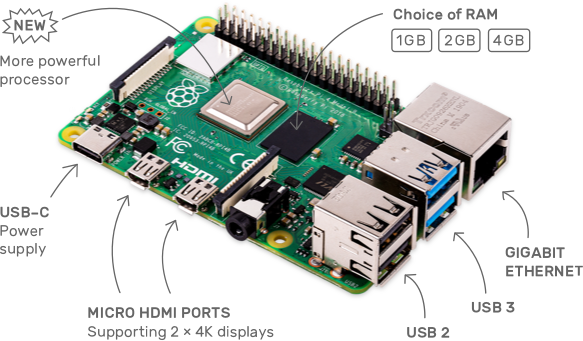

[< Parent](./Readme.md)

# Hardware

## Jetson Nano

NVIDIA Jetson Nano enables the development of millions of new small, low-power AI systems. It opens new worlds of embedded IoT applications, including entry-level Network Video Recorders (NVRs), home robots, and intelligent gateways with full analytics capabilities.

Links:

- <https://www.nvidia.com/en-us/autonomous-machines/embedded-systems/jetson-nano/>

## Raspberry Pi 4 - Model B

The speed and performance of the new Raspberry Pi 4 is a step up from earlier models. For the first time, we've built a complete desktop experience. Whether you're editing documents, browsing the web with a bunch of tabs open, juggling spreadsheets or drafting a presentation, you'll find the experience smooth and very recognisable — but on a smaller, more energy-efficient and much more cost-effective machine.

Links:

- [Raspberry Pi 4](https://www.raspberrypi.org/products/raspberry-pi-4-model-b/)
