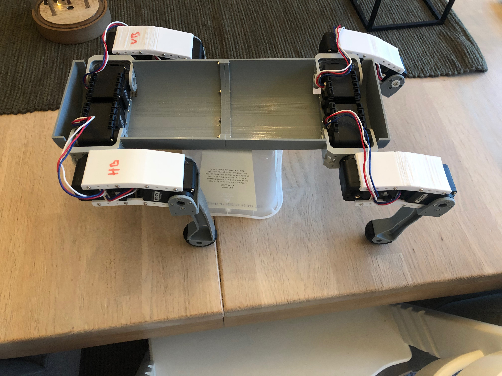
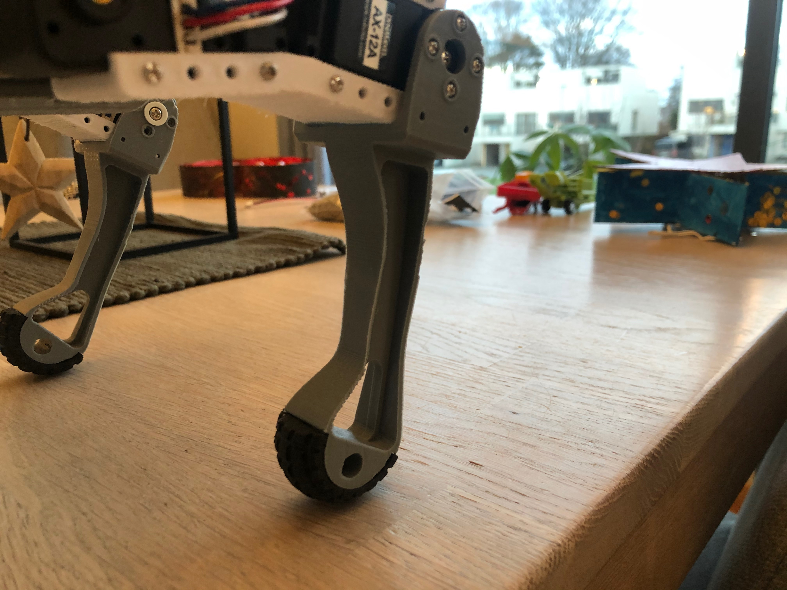

[< Parent](../Readme.md)

# Maximus

## Todo

| Tasks                                 | Timeline | Comment                    | Progress |
| ------------------------------------- | -------- | -------------------------- | -------- |
| Design middle body                    |          | Draw in Fusion 360         |          |
| Get development board circuit to work |          | Full duplex to half duplex |          |
| Set up ROS                            |          |                            |          |

## Body

### Frame v2 - current

### Frame v1

Frame v1 is to unstable. The whole body warps as the frame is to thin and have open cutouts for the legs.

## Components

- [Batteries](./Battery.md)
- [Configure BNO055](./BNO055.md)
- [Development board](./Development%20board.md)
- [Dynamixel AX-12](./Dynamixel%20AX-12.md)
- [GPS](./GPS.md)
- [Other hardware](./Hardware.md)
- [Stereo Pi](https://www.antratek.com/stereopi-starter-kit)

## Robotics

- [Robotics](./robotics.md)
- [ROS](./ROS.md)

## Artificial Intelligence

- [AI Notes](./ai.md)

## Articles

- [Comparing Gyroscope Datasheets](https://learn.adafruit.com/comparing-gyroscope-datasheets)

## Inspiration

- [Inspiration notes](./inspiration.md)

## Books

- [Handbook of PI and PID controller tuning rules (3rd edition)](https://www.amazon.com/HANDBOOK-PID-CONTROLLER-TUNING-RULES/dp/1848162421/ref=sr_1_6?crid=LPT7MUFOO2C8&keywords=pid+controller&qid=1580382043&rnid=2941120011&s=books&sprefix=pid+con%2Caps%2C260&sr=1-6)
- [Model-Reference Robust Tuning of PID Controllers (Advances in Industrial Control)](https://www.amazon.com/Model-Reference-Controllers-Advances-Industrial-Control-ebook/dp/B01EUYVURI/ref=sr_1_3?crid=LPT7MUFOO2C8&keywords=pid+controller&qid=1580382043&rnid=2941120011&s=books&sprefix=pid+con%2Caps%2C260&sr=1-3)
- [PID Control Fundamentals](https://www.amazon.com/PID-Control-Fundamentals-Jens-Graf/dp/1535358661/ref=sr_1_2?crid=LPT7MUFOO2C8&keywords=pid+controller&qid=1580382043&rnid=2941120011&s=books&sprefix=pid+con%2Caps%2C260&sr=1-2)
- [PID Controllers: Theory, Design, and Tuning](https://www.amazon.com/PID-Controllers-Theory-Design-Tuning/dp/1556175167/ref=sr_1_1?crid=LPT7MUFOO2C8&keywords=pid+controller&qid=1580382043&rnid=2941120011&s=books&sprefix=pid+con%2Caps%2C260&sr=1-1)
- [Technician's Guide to Programmable Controllers](https://www.amazon.com/Technicians-Guide-Programmable-Controllers-Borden/dp/1111544093/ref=sr_1_1?crid=LPT7MUFOO2C8&keywords=pid+controller&qid=1580382097&rnid=2941120011&s=books&sprefix=pid+con%2Caps%2C260&sr=1-1)
