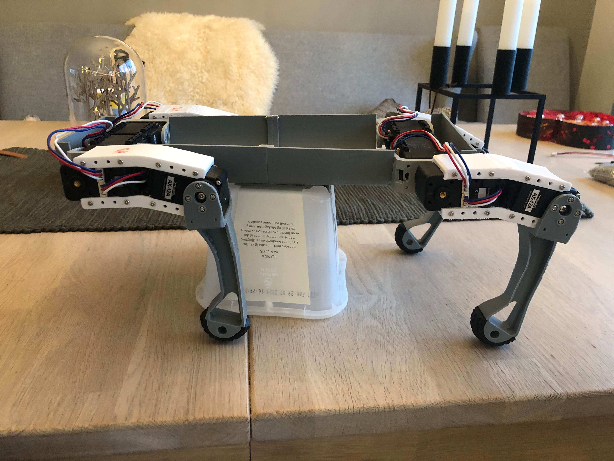
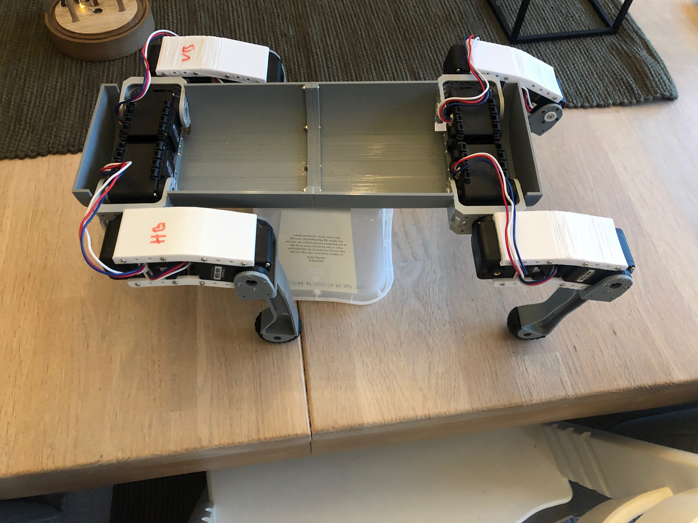
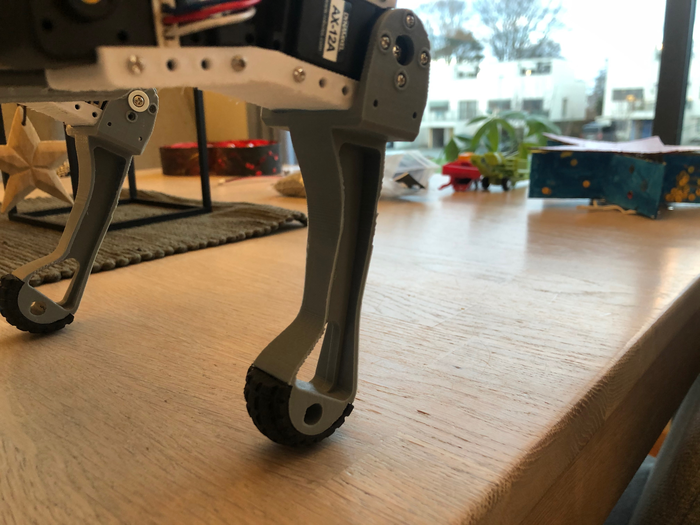
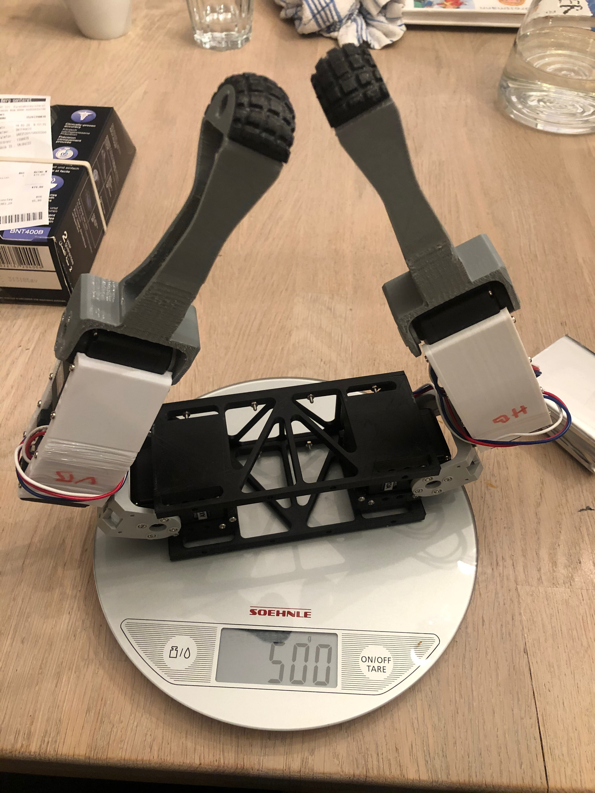

# Maximus

## Frame v1

## Frame v2

## Components

- [Stereo Pi](https://www.antratek.com/stereopi-starter-kit)
- [Configure BNO055](BNO055.md)

## Robotics

- [Robotics](robotics.md)

## Articles

- [Comparing Gyroscope Datasheets](https://learn.adafruit.com/comparing-gyroscope-datasheets)

## Artificial Intelligence

- [AI Notes](ai.md)
