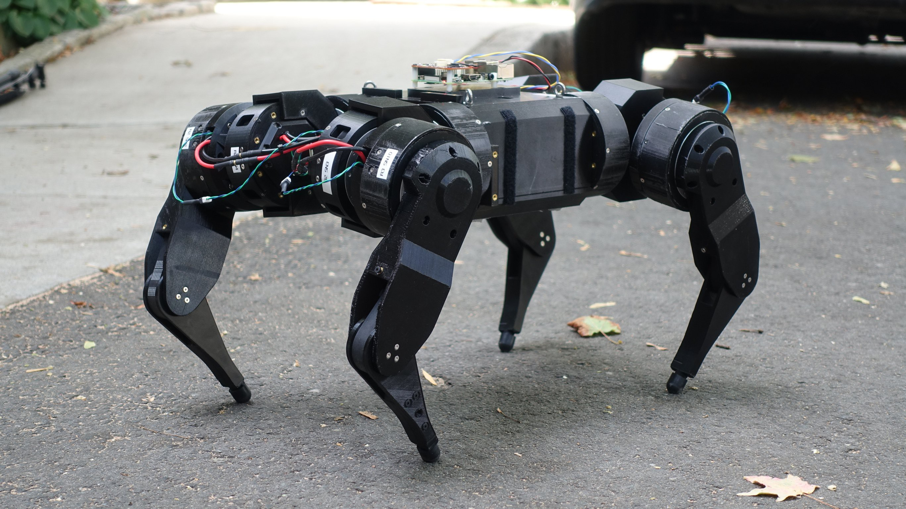

[< Parent](./Readme.md)

# Inspiration

## Read

- [PyRobot](https://www.pyrobot.org/)

## DyRET Robot

DyRET is a four legged (quadruped) robot designed to be a robust and versatile platform for evolutionary experiments with the unique capability of self-changing morphology. The robot runs on ROS, and uses Gazebo for simulated experiments.

### Links

- [DyRET Documentation](https://github.com/dyret-robot/dyret_documentation)

## Open Cat

A programmable and highly maneuverable robotic cat for STEM education and AI-enhanced services.

### Article

<https://www.hackster.io/petoi/opencat-845129>

## Pet dog

A pet robot, just like Boston Dynamics makes

### Articles

- <https://hackaday.com/2019/03/30/a-pet-robot-just-like-boston-dynamics-makes/>
- <https://hackaday.io/project/164493-dizzy-wolf>

## MJBOTS Quad

The mjbots quad is a small dynamic quadruped, like the MIT mini-Cheetah, but fully open source licensed under the Apache 2.0 license. It is capable of dynamic motions like jumping and is relatively low cost.

- [Hackaday.io: mjbots quad](https://hackaday.io/project/167845-mjbots-quad)

## Hexapod

- [Youtube.com: Designing and building a Hexapod!](https://www.youtube.com/watch?v=VwTd5cWJx2M)

## Others

- [Robot Cat](https://www.instructables.com/id/Robot-Cat)
- [Robot gets around on all fours, thanks to many, many servos](https://hackaday.com/2020/10/13/robot-gets-around-on-all-fours-thanks-to-many-many-servos/)
