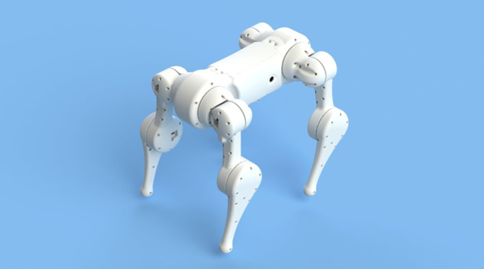

# Maximus robotics

## DyRET Robot

### Links

- [DyRET Documentation](https://github.com/dyret-robot/dyret_documentation)

## Jetson Nano

- <https://www.nvidia.com/en-us/autonomous-machines/embedded-systems/jetson-nano/>

## Open Cat

<https://www.hackster.io/petoi/opencat-845129>

## Pet dog

- <https://hackaday.com/2019/03/30/a-pet-robot-just-like-boston-dynamics-makes/>
- <https://hackaday.io/project/164493-dizzy-wolf>
