# Systemair

Model: Systemair  VR 400 DCV/B R

## Images

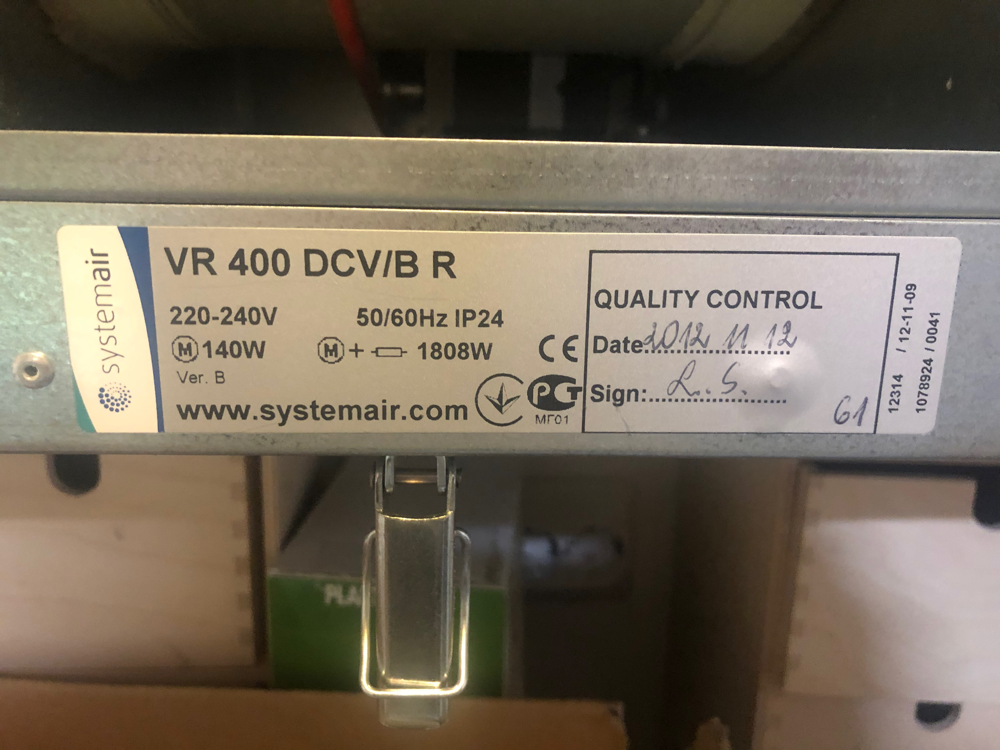
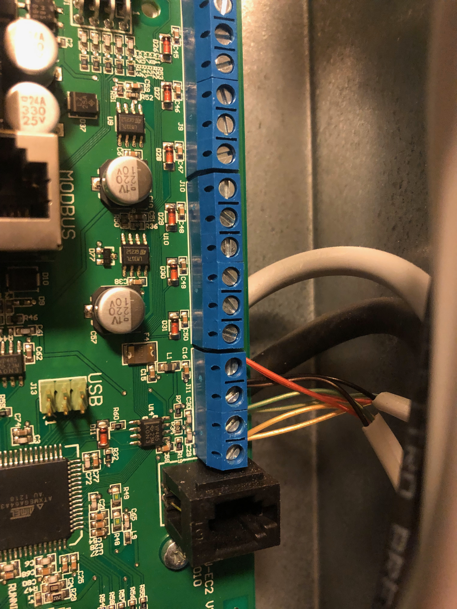
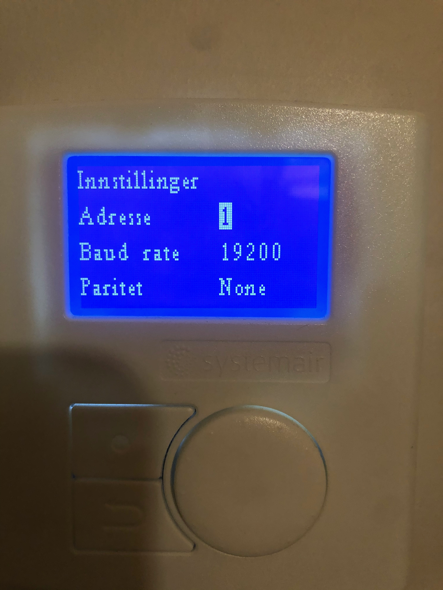
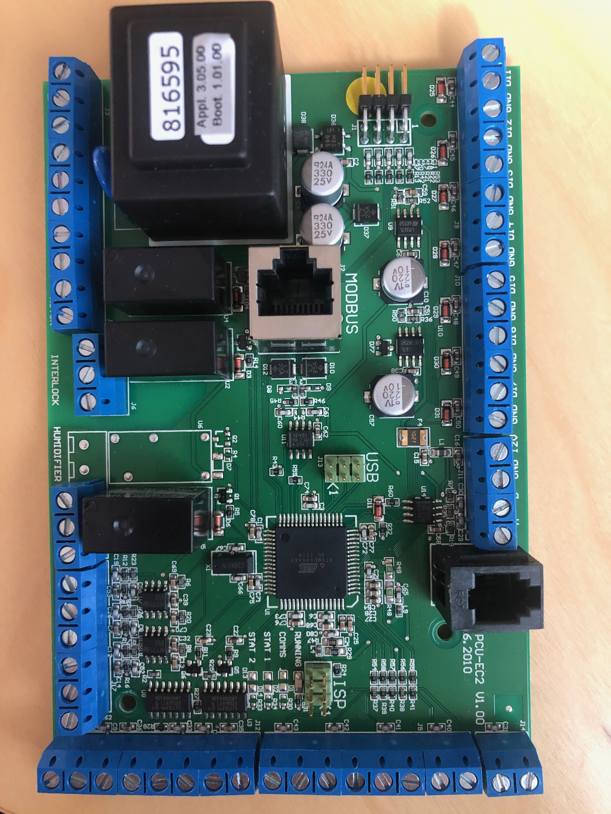
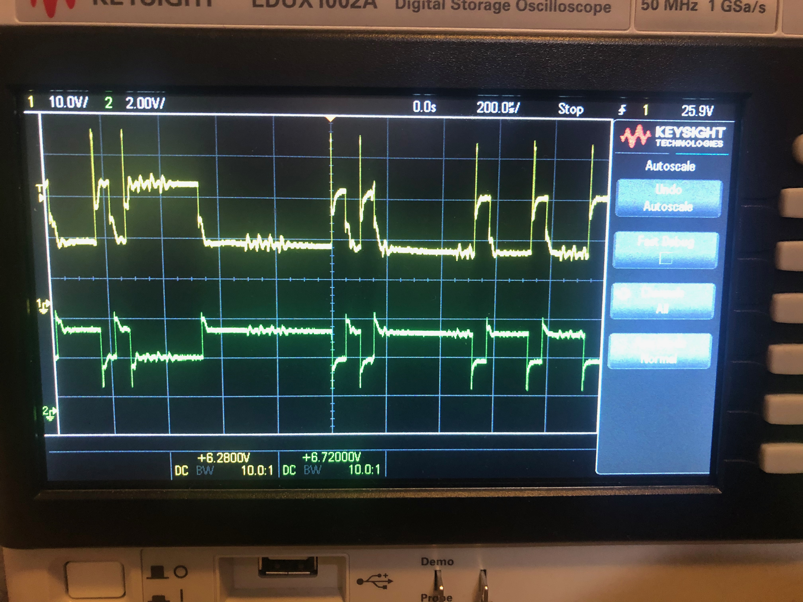

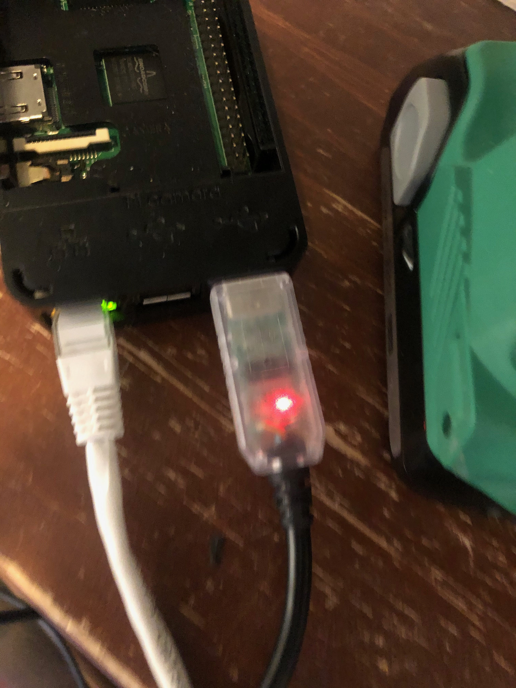
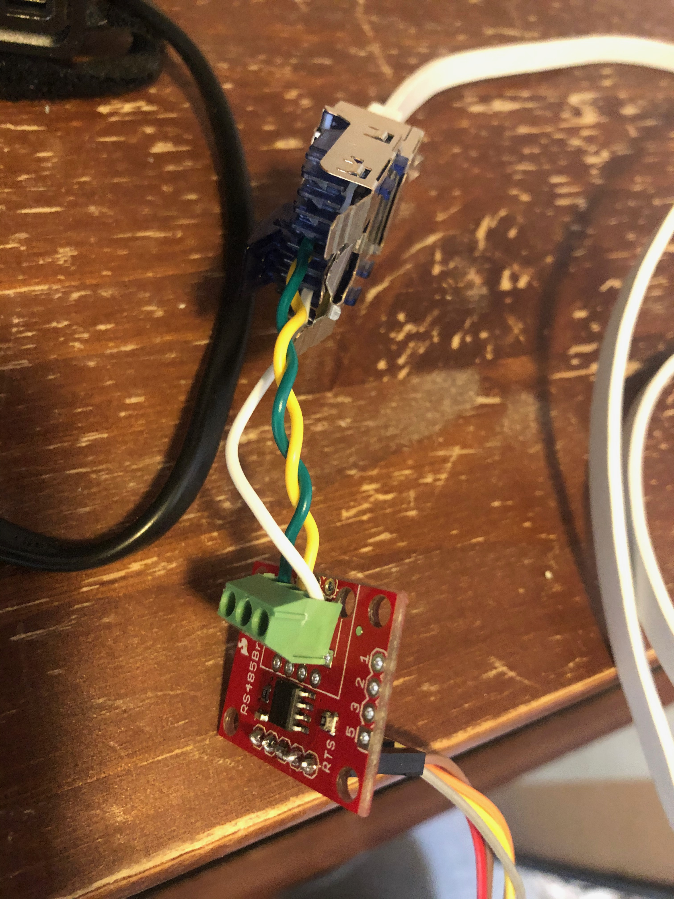
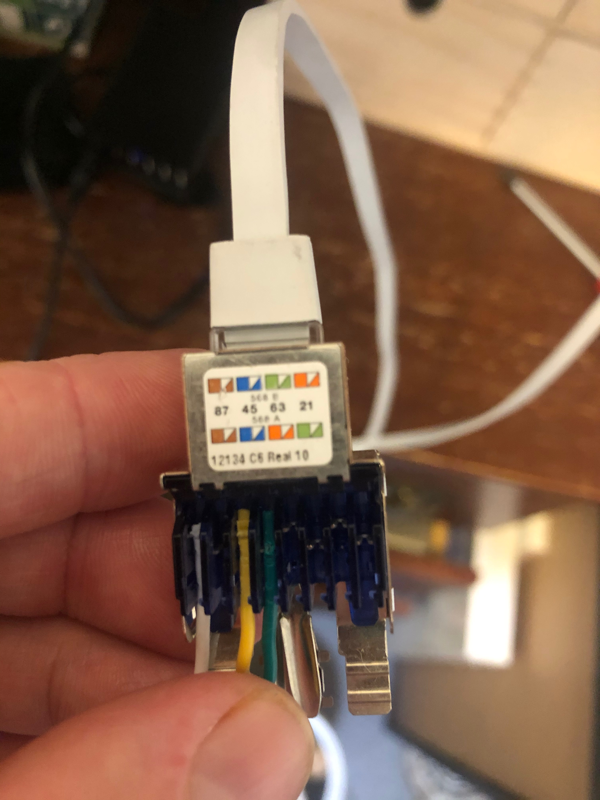
Pin 4 -> B (Blue -> Yellow), Pin 5 -> A (Half Blue -> Green) (Note. I know they are switched around on this picture)

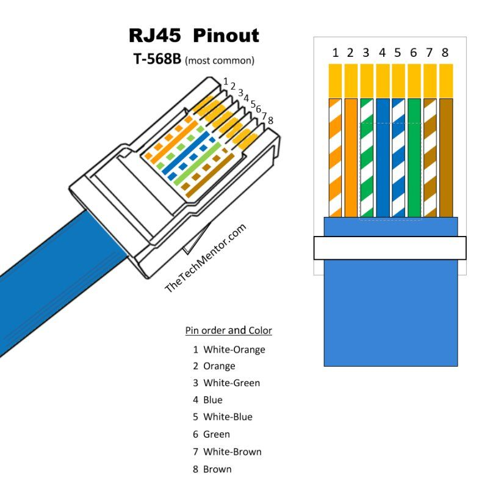

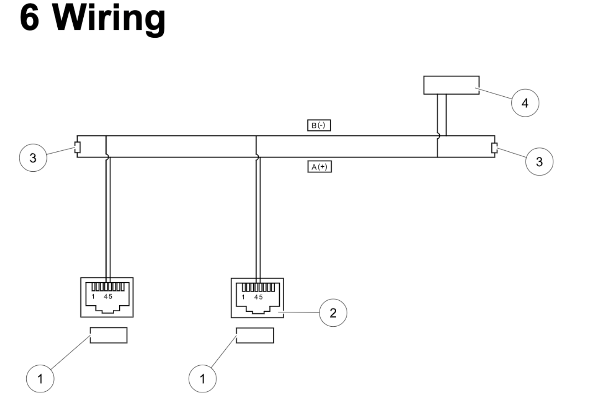

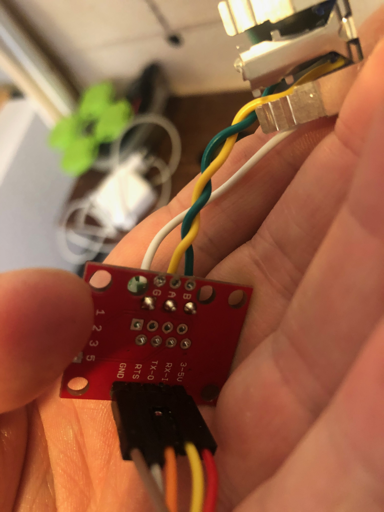

## Hardware

### USB to RS485

```sh
/dev/ttyACM0
```

## Software

[Airiana - SystemAir control](https://github.com/BeamCtrl/Airiana)

```sh
curl https://bootstrap.pypa.io/get-pip.py -o get-pip.py
python get-pip.py
```

## Issues

Unable to connect to Modbus.

Airiana dump of RAM/err and RAM/out:
[Gist Dump](https://gist.github.com/danielkaldheim/cca07903f6734031c1fda6edd6703354)
