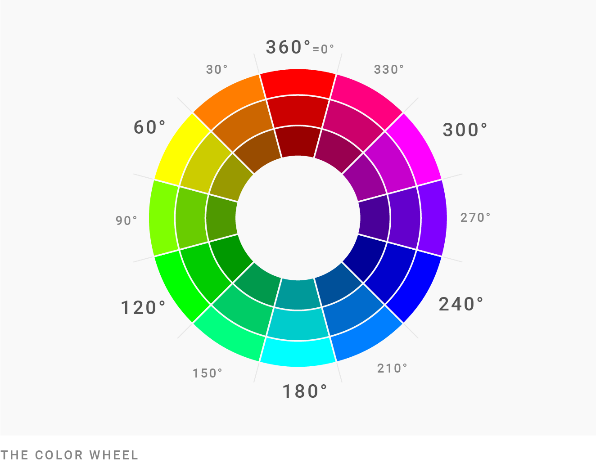

[< Parent](./Readme.md)

# Colors

## Tools

- [Color palette generator](https://www.canva.com/colors/color-palette-generator/)
- [Adobe Color](https://color.adobe.com/nb/create/color-wheel)
- [Color Calculator](https://www.sessions.edu/color-calculator/)
- [Paletton](https://paletton.com/)

## Articles

- [How to pick more beautiful colors for your data visualizations](https://blog.datawrapper.de/beautifulcolors/)
